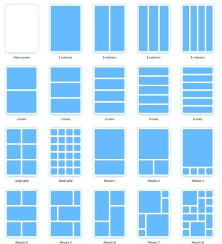
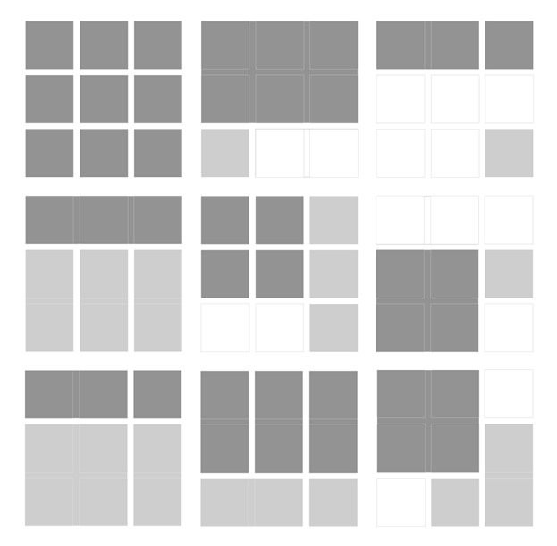

# CSS_grid
Выполнение лабораторной работы по теме CSS_Grid

Цель работы: изучить базовые возможности настройки макета с помощью технологии Grid CSS.

Ход работы

Научится использовать технологию разметки CSS Grid, начиная с простых примеров, создавая каждую таблицу из иллюстрации ниже.

После освоения основных свойств, можно переходить к более сложным макетам. Ниже представлен макет , состоящий из 9 блоков, в каждом из которых вложена своя таблица. Следует реализовать механизм вложенности таблиц друг в друга.

После того как будет создана такая сложная структура, нужно реализовать медиазапросы (media queries), чтобы при уменьшении окна браузера, раскладка макета менялась на 2-х и одно колоночную.

