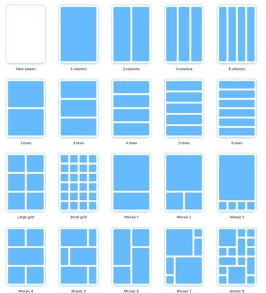

# CSS_grid
Выполнение лабораторной работы по теме CSS_Grid

Цель работы: изучить базовые возможности настройки макета с помощью технологии Grid CSS.

Ход работы

Научится использовать технологию разметки CSS Grid, начиная с простых примеров, создавая каждую таблицу из иллюстрации ниже.

